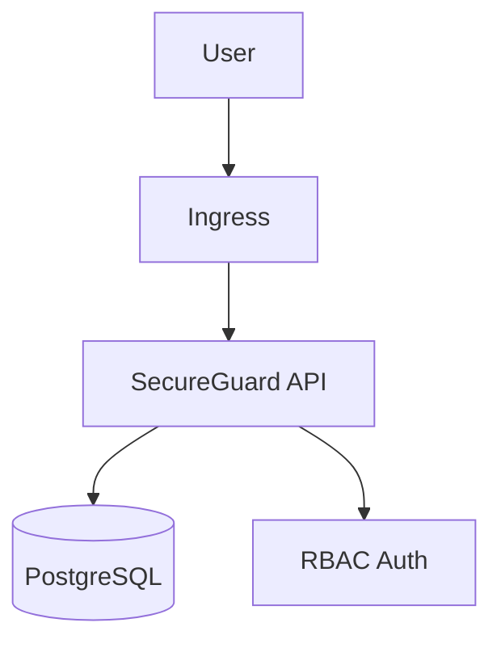

# SecureGuard - Security Management Platform

SecureGuard is a Go-based security management platform for tracking assets, vulnerabilities, and incidents. It provides robust role-based access control (RBAC), secure data handling, and a RESTful API built with Gin.

## Features
- **Role-Based Access Control (RBAC)**:
  - `Admin`: Full access to all operations
  - `Analyst`: Create/manage incidents, vulnerabilities, assets
  - `Viewer`: Read-only access
- **Management Modules**:
  - Assets with vulnerability mapping
  - Vulnerability tracking
  - Incident management
- **Security**:
  - Bcrypt password hashing
  - SQL injection prevention
  - Prepared statements for database security

## Architecture


## Technologies
| Component       | Technology        |
|----------------|-------------------|
| Language        | Go 1.19+          |
| Framework       | Gin               |
| Database        | PostgreSQL 14+    |
| Container       | Docker 20.10+     |
| Orchestration   | Kubernetes 1.24+  |
| Packaging       | Helm 3.8+         |

## Quick Start

### 1. Docker Compose (Development)
```bash
docker-compose up -d
```
Access API at `http://localhost:8080`

### 2. Kubernetes Deployment

#### Prerequisites
- Kubernetes cluster (v1.24+)
- PostgreSQL instance (or use included `db-statefulset.yaml`)

#### Steps:
1. Create namespace:
   ```bash
   kubectl create namespace secureguard
   ```
2. Apply manifests:
   ```bash
   kubectl apply -f kubernetes/
   ```

### 3. Helm Deployment
```bash
helm install secureguard ./helm \
  --set postgres.enabled=true \
  --namespace secureguard
```

## Kubernetes Components

The `kubernetes/` directory contains:
- `api-depl.yaml`: SecureGuard API deployment
- `api-svc.yaml`: ClusterIP service
- `ingress.yaml`: Ingress configuration
- `ingress-class.yaml`: Ingress Class
- `db-sfs.yaml`: PostgreSQL StatefulSet
- `db-svc.yaml`: Headless PostgreSQL service
- `migrations.yaml`: Database Migrations
- `namespace.yaml`: Namespace configuration
- `secret.yaml`: Secret configuration

## Helm Chart Structure
```
secureguard-helm/
├── Chart.yaml
├── templates/
│   ├── api-depl.yaml
│   ├── api-svc.yaml
│   ├── db-sfs.yaml
│   ├── db-svc.yaml
│   ├── ingress.yaml
│   ├── ingress-class.yaml
│   ├── migrations.yaml
│   ├── namespace.yaml
│   ├── secret.yaml
└── values.yaml 
```

## Configuration

Set environment variables in `config.yaml`: 
```yaml
database:
  DB_URL: "postgres-hl.secureguard.svc.cluster.local"
  POSTGRES_USER: "admin"
  POSTGRES_PASSWORD: "securepassword"
api:
  PORT: 4000
```

## API Endpoints

| Method | Endpoint              | Description                      |
|--------|-----------------------|----------------------------------|
| POST   | `/users/register`     | Register new user                |
| POST   | `/users/login`        | Authenticate user                |
| GET    | `/assets`             | List all assets (RBAC protected) |
| POST   | `/vulnerabilities`    | Create vulnerability record      |

## Production Deployment Best Practices

1. **Database**:
  - Use cloud-managed PostgreSQL (RDS, Cloud SQL)
  - Enable automated backups

2. **Security**:
   ```bash
   kubectl create secret generic db-creds \
     --from-literal=username=admin \
     --from-literal=password='S3cure!P@ss' \
     -n secureguard
   ```

3. **Monitoring**:
  - Add Prometheus annotations to deployments
  - Configure Grafana dashboards

## Troubleshooting

**Database Connection Issues**:
1. Verify DNS resolution:
   ```bash
   kubectl exec -it <api-pod> -- nslookup postgres-hl
   ```
2. Check PVC binding status:
   ```bash
   kubectl get pvc -n secureguard
   ```

**RBAC Errors**:
- Verify JWT_SECRET matches across deployments
- Check role assignments in database

## Contributing
1. Fork the repository
2. Create feature branch (`git checkout -b feature/improvement`)
3. Commit changes with descriptive messages
4. Open pull request against `main` branch

## Resources

- **Docker Image**: [docker.io/akshayyyyy/secureguard](https://hub.docker.com/r/akshayyyyy/secureguard)
- **Helm Chart (OCI)**: `oci://docker.io/akshayyyyy/secureguard`

## Additional Deployment File With Detailed Deployment Steps

- [SecureGuard Custom Deployment YAML (Google Drive)](https://drive.google.com/file/d/1yI1pj61UxEjp5zri7PAmOJjoCV5xvcnm/view?usp=sharing)